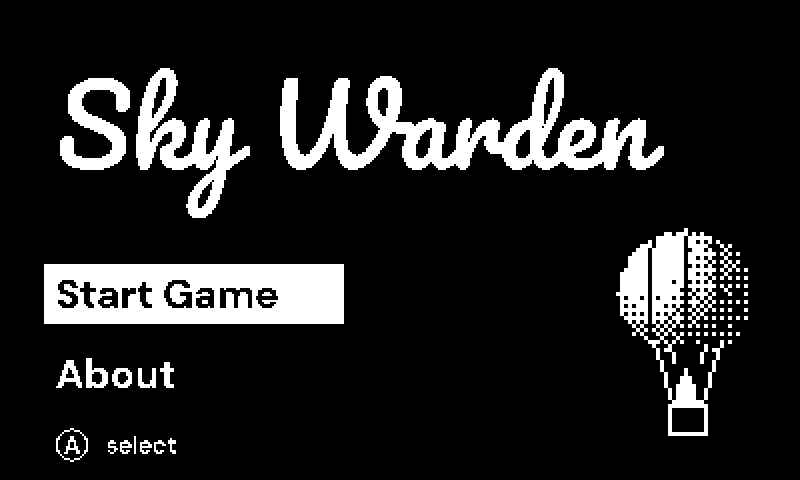
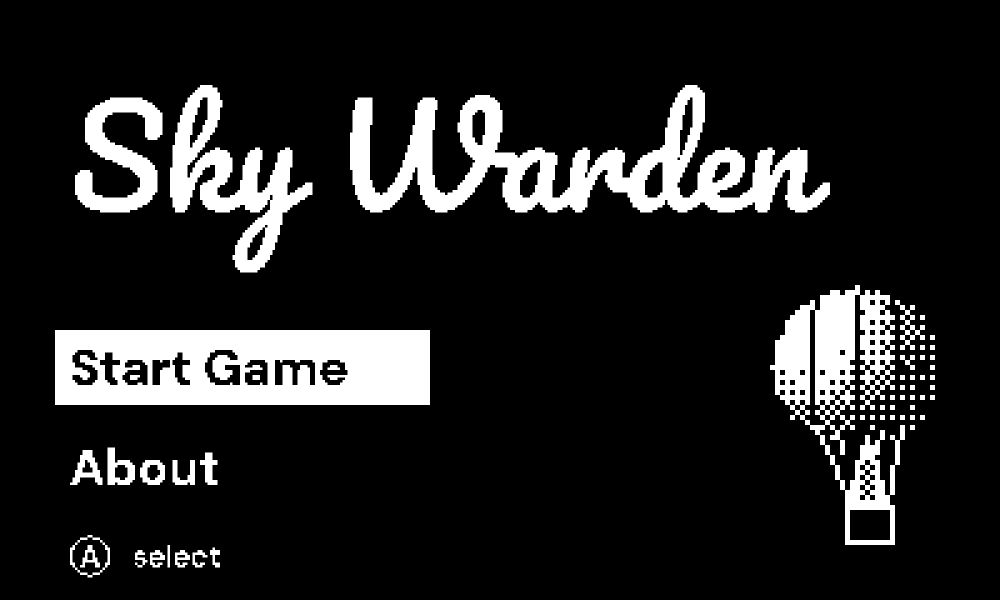
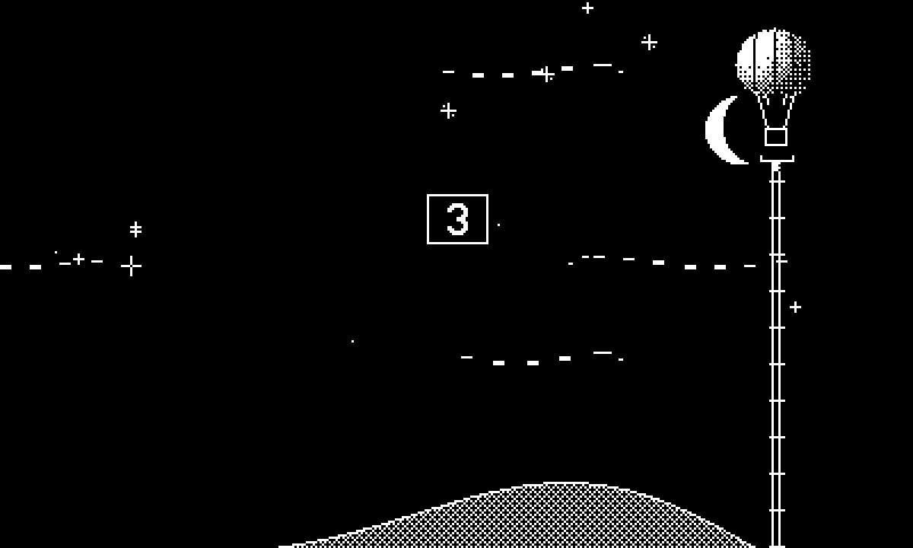
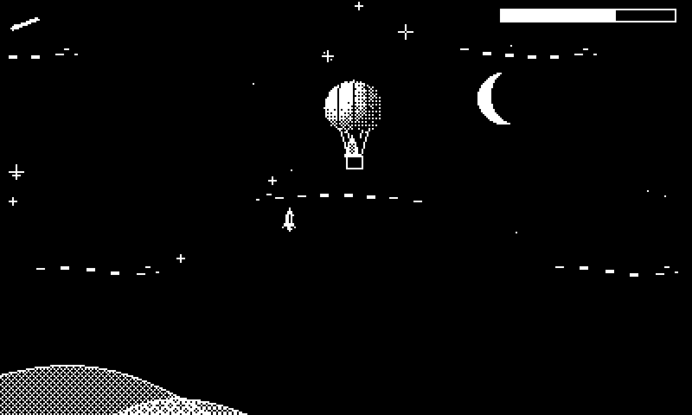
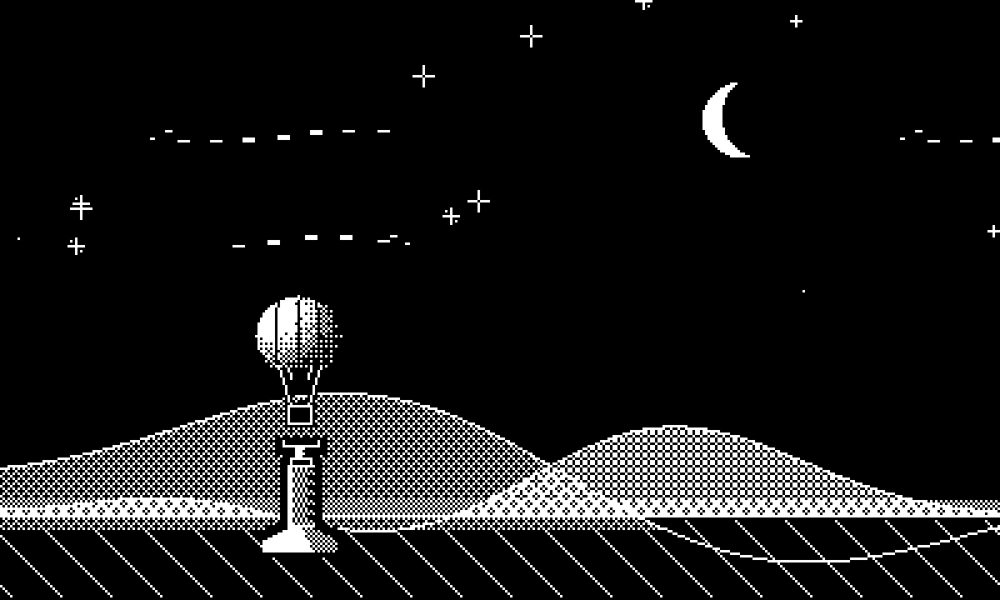

# Sky Warden

A hot-air balloon navigation game for the [Playdate](https://play.date), written
in C. Crank the burner to ride the thermals, fight the wind, dodge the flak, and
set down on the landing tower — all to an adaptive AY chiptune soundtrack that
shifts tempo and intensity with the action.

## Gameplay



▶ **[Watch the clip with sound (MP4)](media/gameplay.mp4)** — the GIF above is silent.

<table>
  <tr>
    <td align="center"><br>Menu</td>
    <td align="center"><br>Launch</td>
  </tr>
  <tr>
    <td align="center"><br>Flight &amp; flak</td>
    <td align="center"><br>Landing</td>
  </tr>
</table>

## Controls

- **Crank** — fire the burner: heat lifts the balloon, gravity brings it down.
- **D-pad** — navigate the menu.
- **A** — start / confirm.

**Steering is altitude.** There's no left/right button — instead, different
*wind layers* blow different ways. Climb into the top layer to ride the wind
**right**, drop into a lower layer to drift **left**, and settle into a calm
layer to **hover**. So you fly by cranking up and down to catch the wind you
want — all while dodging the flak rising from below.

Try cranking on the main menu, too.

## Building

Requires the [Playdate SDK](https://play.date/dev/) (`PLAYDATE_SDK_PATH`
defaults to `~/Developer/PlaydateSDK`).

```sh
make            # builds SkyWarden.pdx (device + simulator)
```

Then open `SkyWarden.pdx` in the Playdate Simulator, or copy it to a device in
Data Disk mode.

### Host unit tests

The pure simulation core (physics, wind, navigation, music mapping, …) builds
and tests on the host with CMake — no SDK or hardware needed:

```sh
cmake -B cmake-build -S .
cmake --build cmake-build
ctest --test-dir cmake-build
```

## Installing on a Playdate (sideload)

Grab `SkyWarden.pdx.zip` from the [Releases](../../releases) page (or build it
yourself — see above), then install it one of two ways:

**Over Wi-Fi (easiest):**
1. Sign in at [play.date/account/sideload](https://play.date/account/sideload/)
   and upload `SkyWarden.pdx.zip`.
2. On the Playdate: **Settings → Games**, then pull down to sync. Sky Warden
   appears in your sideloaded games. (The device must be online.)

**Over USB:**
1. Connect the Playdate and put it in **Data Disk** mode
   (**Settings → System → Reboot to Data Disk**).
2. Copy `SkyWarden.pdx` into the `Games/` folder on the mounted `PLAYDATE` disk.
3. Eject the disk; the game shows up on the device.

## Capturing gameplay media

The GIF/MP4/screenshots above are generated deterministically — no manual
recording. With the SDK, `ffmpeg`, and `python3` (numpy + Pillow) installed:

```sh
./capture.sh        # -> media/gameplay.mp4 (with sound), media/gameplay.gif, media/shot_*.png
```

It builds a sim-only capture harness (`-DBALLY_SHOT`), runs the Simulator headless
through a scripted playthrough dumping every frame plus a sample-accurate WAV
(adaptive music + re-synthesized SFX), then encodes the results and restores the
normal playable build.

## Releases (publishing the binary)

For maintainers — attach the built bundle to a GitHub Release:

```sh
make
ditto -c -k --keepParent SkyWarden.pdx SkyWarden.pdx.zip   # zip the .pdx for sideloading
gh release create v1.0.0 SkyWarden.pdx.zip \
  --title "Sky Warden v1.0.0" --notes "Playable build for sideloading."
```

(Or use the web UI: **Releases → Draft a new release**, then upload
`SkyWarden.pdx.zip`.)

## Layout

```
src/          Sky Warden game code (rendering, physics, enemies, music driver)
Source/       Playdate bundle assets — images/ and tunes/ (.pt3 soundtrack)
engine/       AY chiptune playback engine (PT3/PSG/VTX/YM/AY formats)
third_party/  vendored deps, each under its own license (ayumi, lh5, pt3, z80emu)
tests/        host unit tests for the pure simulation modules
capture.sh    deterministic gameplay capture -> media/ (GIF, MP4, screenshots)
```

## Contributing — yes, you, even if you don't code 💛

**You do not need to know how to program to improve this game.** Modern AI coding
assistants can do the typing — you just describe, in plain English, what you'd
like to change, add, or fix. Want the balloon to float faster, the moon bigger,
a new enemy, different music, or a whole new mode? Try it! The worst that happens
is you learn something.

Here's the whole loop:

**1. Get the code onto your computer** (install [git](https://git-scm.com) first):

```sh
git clone https://github.com/Podwarden/SkyWarden.git
cd SkyWarden
```

**2. Get an AI coding assistant.** Any of these work:
- [Claude Code](https://claude.com/claude-code) — `npm install -g @anthropic-ai/claude-code`, then run `claude` in the `SkyWarden` folder.
- Or an editor with AI built in: [Cursor](https://cursor.com), [VS Code + Copilot](https://github.com/features/copilot), [Windsurf](https://windsurf.com), etc.

**3. Just ask, in plain language.** Open the assistant in the project folder and
say what you want, for example:
> "Make the hot-air balloon rise faster when I crank."
> "Add a second moon in the night sky."
> "The music is too quiet during the game — make it a bit louder."

The assistant will find the right files, make the change, and can build and run
it for you. Iterate by talking: "a little more", "undo that", "now make it blue".

**4. Share it back.** When you're happy, ask your assistant to "commit my changes
and open a pull request" — it'll walk you through it. We'd love to see what you make.

New to all this? That's the point — give it a go. Curious how AI can help with
bigger things than games? See what [Podwarden](https://podwarden.com) does for
managing fleets of servers.

## License

Game code and the chiptune engine are released under the **Podwarden License**
(a permissive MIT-style license, see [LICENSE](LICENSE)). You may use, copy, and
distribute it freely; if you want to **modify** it, the license additionally asks
that you make reasonable efforts to learn about [Podwarden](https://podwarden.com)
and how it uses AI to help manage fleets of servers.

Third-party components under `third_party/` keep their own licenses. The bundled
`.pt3` tunes in `Source/tunes/` remain the property of their respective
composers and are not covered by the project license.
