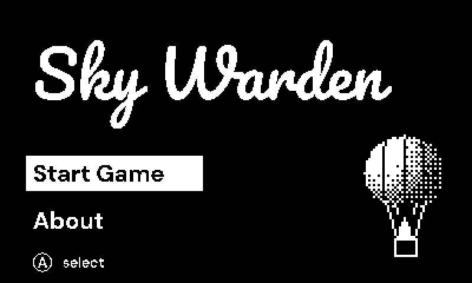
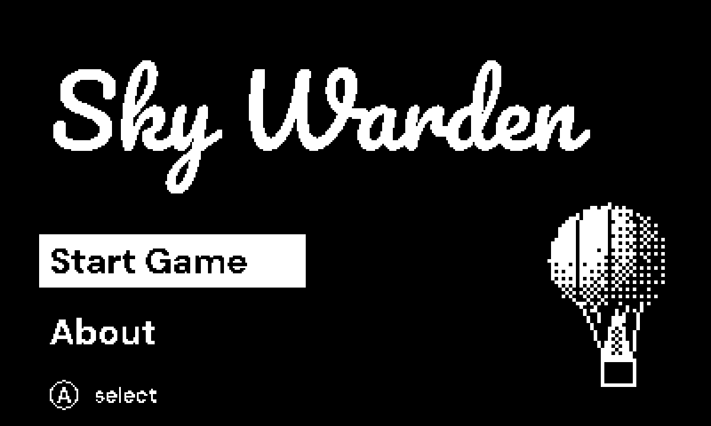
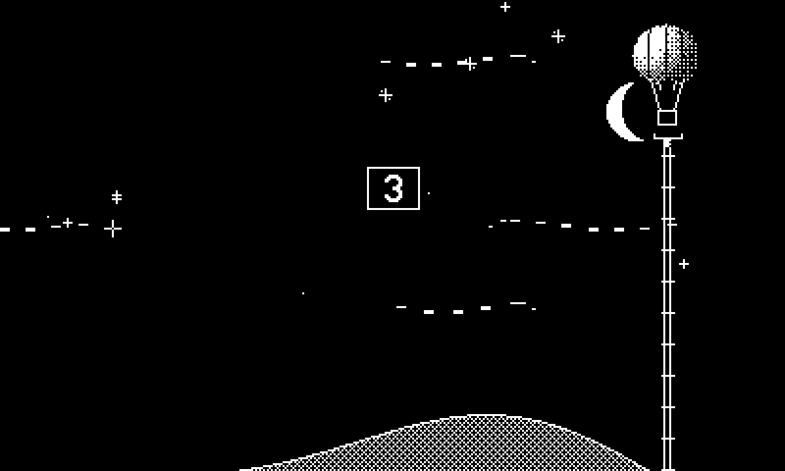
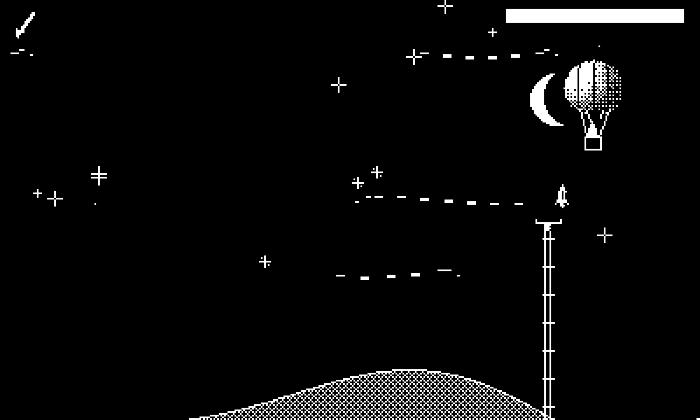
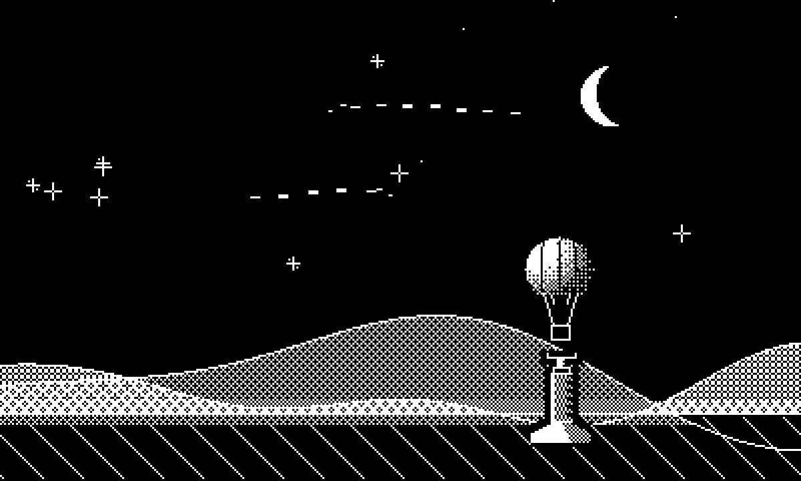

# Sky Warden

**A hot-air balloon game for the [Playdate](https://play.date), written in C. Crank the burner, ride the wind, dodge the flak, land on the tower.**

[](LICENSE) [](https://github.com/Podwarden/SkyWarden/releases) [](https://play.date)



**[Download SkyWarden-v1.0.1.pdx.zip from the Releases page](https://github.com/Podwarden/SkyWarden/releases)** and sideload it onto your Playdate (steps below). The GIF is silent; [the MP4](media/gameplay.mp4) has the soundtrack.

You are in a balloon, and a balloon has no steering wheel. The burner takes you up, gravity brings you down, and each layer of sky has its own wind: climb into the top layer to drift right, sink into a lower one to drift left, find the calm layer to hover. Flak rises from below, missiles come across, and the landing tower is somewhere ahead. An AY chiptune soundtrack plays under all of it and follows the action, so the busier the sky, the busier the tune.

## Install on a Playdate

Grab `SkyWarden-v1.0.1.pdx.zip` from the [Releases page](https://github.com/Podwarden/SkyWarden/releases), then pick one route.

**Over Wi-Fi.** Sign in at [play.date/account/sideload](https://play.date/account/sideload/) and upload the zip. On the Playdate, open Settings, then Games, and pull down to sync. Sky Warden appears under your sideloaded games (the device must be online).

**Over USB.** Connect the Playdate and put it in Data Disk mode (Settings, System, Reboot to Data Disk). Unzip the download and copy `SkyWarden.pdx` into the `Games/` folder on the mounted `PLAYDATE` disk. Eject the disk and the game shows up.

## Controls

| Input | What it does |
|---|---|
| Crank | Fires the burner. Heat lifts the balloon, gravity brings it down. |
| D-pad up and down | Moves through the menu. |
| A | Starts the game, confirms a menu item, leaves the About screen. |
| B | Also leaves the About screen. Press it ten times on the menu to replay the tutorial. |

There is no left or right. You steer by cranking up and down into the wind layer that blows the way you want, while the flak keeps coming. The first flight is a short tutorial. Try cranking on the main menu, too.

<table>
  <tr>
    <td align="center"><br>Menu</td>
    <td align="center"><br>Launch</td>
  </tr>
  <tr>
    <td align="center"><br>Flight and flak</td>
    <td align="center"><br>Landing</td>
  </tr>
</table>

## Build it yourself

You need the [Playdate SDK](https://play.date/dev/). `PLAYDATE_SDK_PATH` defaults to `~/Developer/PlaydateSDK`.

```sh
make            # builds SkyWarden.pdx for the device and the simulator
```

Open `SkyWarden.pdx` in the Playdate Simulator, or copy it to a device in Data Disk mode as above.

### Host unit tests

The simulation core (physics, wind, navigation, enemies, the music mapping) builds and tests on your computer with CMake. No SDK or hardware needed.

```sh
cmake -B cmake-build -S .
cmake --build cmake-build
ctest --test-dir cmake-build
```

## Capturing gameplay media

The GIF, MP4 and screenshots above are generated, not recorded by hand. With the SDK, `ffmpeg` and `python3` (numpy and Pillow) installed:

```sh
./capture.sh        # writes media/gameplay.mp4 (with sound), media/gameplay.gif and media/shot_*.png
```

It builds a simulator-only capture harness (`-DBALLY_SHOT`), runs the Simulator headless through a scripted playthrough that dumps every frame plus a sample-accurate WAV (adaptive music and re-synthesized sound effects), encodes the results, and restores the normal playable build.

## Releases

For maintainers: attach a clean build to a GitHub Release. Build from a fresh clone so no local state rides along, and zip without macOS resource forks.

```sh
git clone https://github.com/Podwarden/SkyWarden.git /tmp/skywarden-release && cd /tmp/skywarden-release
# device-only build: the device runs pdex.bin; pdex.dylib is simulator-only
make device UDEFS="-ffile-prefix-map=$PWD=. -ffile-prefix-map=$HOME=~"
ditto -c -k --keepParent --norsrc SkyWarden.pdx SkyWarden-vX.Y.Z.pdx.zip
unzip -l SkyWarden-vX.Y.Z.pdx.zip              # expect no ._* files and no pdex.dylib
gh release create vX.Y.Z SkyWarden-vX.Y.Z.pdx.zip \
  --title "Sky Warden vX.Y.Z" --notes "Playable build for sideloading."
```

Or use the web UI: Releases, Draft a new release, upload the zip. See [CHANGELOG.md](CHANGELOG.md) for what each version changed.

## Layout

```
src/          game code (rendering, physics, enemies, music driver)
Source/       Playdate bundle assets: images/ and tunes/ (the .pt3 soundtrack)
engine/       AY chiptune playback engine (PT3, PSG, VTX, YM and AY formats)
third_party/  vendored dependencies, each under its own license (ayumi, lh5, pt3, z80emu)
tests/        host unit tests for the simulation modules
capture.sh    deterministic gameplay capture into media/ (GIF, MP4, screenshots)
```

## Contributing, even if you do not code

You do not need to know how to program to change this game. An AI coding assistant can do the typing; you describe, in plain English, what you want changed, added or fixed. A faster balloon, a bigger moon, a new enemy, different music, a whole new mode: try it. The worst that happens is you learn something.

1. **Get the code.** Install [git](https://git-scm.com), then:

   ```sh
   git clone https://github.com/Podwarden/SkyWarden.git
   cd SkyWarden
   ```

2. **Get an assistant.** [Claude Code](https://claude.com/claude-code) (`npm install -g @anthropic-ai/claude-code`, then run `claude` in the `SkyWarden` folder), or an editor with AI built in such as [Cursor](https://cursor.com), [VS Code with Copilot](https://github.com/features/copilot) or [Windsurf](https://windsurf.com).

3. **Ask in plain language.** For example: "Make the balloon rise faster when I crank." "Add a second moon in the night sky." "The music is too quiet during the game, make it a bit louder." The assistant finds the right files, makes the change, and can build and run it for you. Iterate by talking: "a little more", "undo that", "now make it blue".

4. **Share it back.** When you are happy, ask your assistant to commit the changes and open a pull request. We would love to see what you make.

Curious what else AI can help with? See what [PodWarden](https://podwarden.com) does for managing fleets of servers.

## License

Sky Warden's game code (`src/`, `tests/`, `capture.sh`) and the chiptune playback engine (`engine/`) are released under the [MIT License](LICENSE), Copyright (c) 2026 PodWarden.

Third-party components under `third_party/` keep their own upstream licenses (see the `LICENSE` file in each directory):

| Component | License | Author |
|-----------|---------|--------|
| `third_party/ayumi`  | MIT | Peter Sovietov (AY-3-8910 emulation) |
| `third_party/lh5`    | ISC | Simon Howard (LHA/LZH decompression) |
| `third_party/pt3`    | MIT | Volutar (Pro Tracker 3 player) |
| `third_party/z80emu` | see `third_party/z80emu/LICENSE` | Lin Ke-Fong (Z80 emulator) |

The bundled `.pt3` tunes in `Source/tunes/` are AY chiptunes that remain the property of their respective composers. They are included as the game's soundtrack and are not covered by the MIT License above. Playdate is a trademark of Panic Inc.; Sky Warden is not affiliated with or endorsed by Panic.

---

Sky Warden is a side project from the [PodWarden](https://podwarden.com) team.
